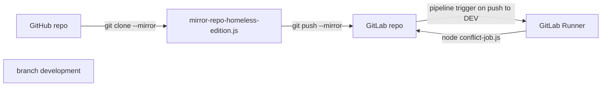

# gitlab‑github‑mirror‑test

Мини‑песочница, в которой демонстрируется два приёма:

1. **Автосинхронизация GitHub → GitLab**  
   (`mirror-repo-homeless-edition.js` крутится где угодно — хоть на ноуте, хоть в отдельном контейнере — и раз в `INTERVAL_SEC` тянет изменения из GitHub и пушит их в GitLab).

2. **Генерация «конфликт‑файла» в ветке `development`**  
   GitLab‑CI запускает `conflict-job.js` → скрипт создаёт/обновляет `dev_conflict.txt`, коммитит и пушит.  
   Если кто‑то успел запушить раньше — получат реальный конфликт и поймут, что локальная ветка устарела.

---

## Состав репозитория

| файл                            | зачем нужен                                                                              |
|---------------------------------|------------------------------------------------------------------------------------------|
| `.gitlab-ci.yml`                | одна стадия `conflict`, выполняет `node conflict-job.js`                                 |
| `conflict-job.js`               | вытягивает ветку **development**, зовёт `generate-dev-conflict.js`, пушит обратно        |
| `generate-dev-conflict.js`      | пишет в `dev_conflict.txt` UID, дату, хеш коммита + 1000 строк шума для уверенного конфликта |
| `mirror-repo-homeless-edition.js` | «раннер для бедных»: обычный Node‑скрипт, который циклически зеркалит GitHub → GitLab     |
| `gitlab-docker-compose.yml`*    | быстрый локальный CE GitLab (порт `8929`)                                                |
| `dev_conflict.txt`              | сгенерированный пример                                                                  |

\* Файл лежит для удобства локального теста, в CI не участвует.

---

## Быстрый старт

### 1. GitHub → GitLab зеркало
```bash
# переменные — как минимум токены
set REMOTE_REPO=https://<GH_TOKEN>@github.com/<user>/<repo>.git
set GITLAB_REPO=http://localhost:8929/root/gitlab-github-mirror-test.git
set GITLAB_USER=root
set GITLAB_PASS=<GL_TOKEN_OR_PASS>
node mirror-repo-homeless-edition.js
````

Скрипт mirror-repo-homeless-edition.js сам создаёт временный bare‑клон, меняет push‑remote на GitLab и делает `git push --mirror`.
По‑умолчанию интервал — 60 секунд, правится переменной `INTERVAL_SEC`.

### 2. Конфликт‑джоба

* На GitLab‑инстансе регистрируешь **shell‑runner** с тегом `runner`.
* В переменных CI/CD проекта заводишь `GITHUB_TOKEN`.
* Пушишь в `development` — GitLab‑CI запускает `generate_and_push_conflict`, файл появляется (или обновляется) прямо в GitHub‑репозитории.

---

## Переменные окружения, которые действительно нужны

| переменная     | где используется                  | что положить                                       |
| -------------- | --------------------------------- | -------------------------------------------------- |
| `GITHUB_TOKEN` | `conflict-job.js`                 | GitHub PAT с правом **repo\:write**                |
| `INTERVAL_SEC` | `mirror-repo-homeless-edition.js` | задержка в секундах (по умолчанию 60)              |
| `GITLAB_PASS`  | `mirror-repo-homeless-edition.js` | пароль или personal‑token GitLab (если нужен push) |

---

## Как это работает (коротко)



---

## Чего тут **нет**

* Bidirectional mirror (в обе стороны) — здесь только GitHub → GitLab.
* Синхрона issues / PR — только код.
* Защиты от «дедлока», когда оба скрипта пушат одновременно (для демо не нужно).

---

## TODO/идеи

* Переписать mirror‑скрипт на cron‑job внутри Docker‑контейнера.
* Добавить Slack / Telegram нотификацию, если push упал не fast‑forward.
* Сгенерировать badge “Last mirror OK / FAIL” прямо в README.

---

### Лицензия

MIT @ vibe coding edition

Делайте что хотите, если что‑то сгорит — вы были предупреждены 🤟
